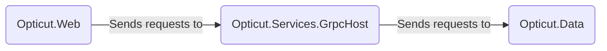
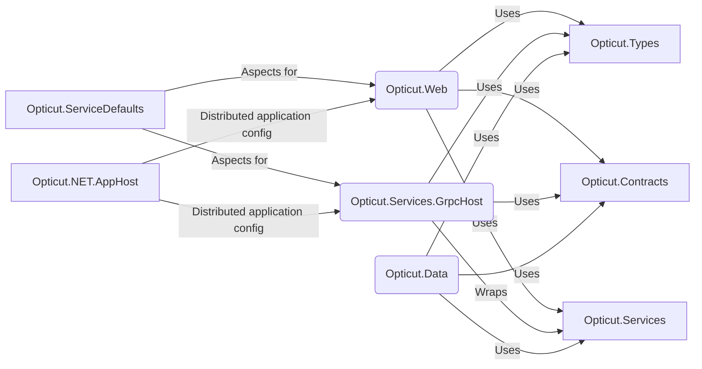
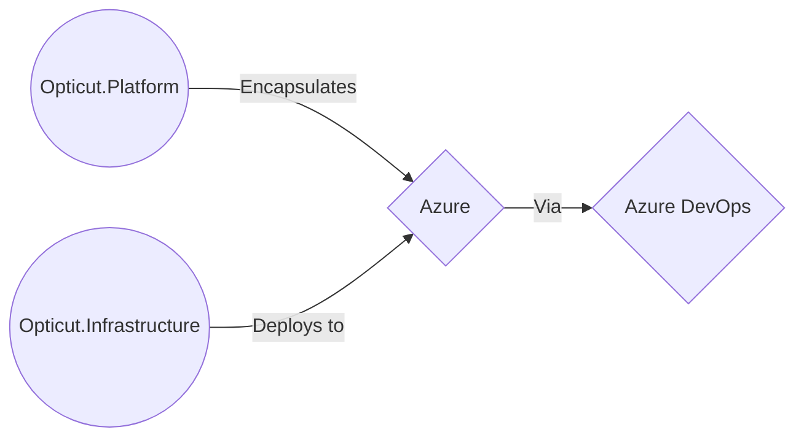

# Opticut.NET

The .NET 9 version of the PHP code for Opticut. 

This project is hosted on Azure DevOps (TFVC) where the main development is done. Codeberg is an old copy of the TFVC repository on Azure DevOps just to for visibility to others without having to assign an Azure DevOps licence to others.

## Opticut.Contracts

Contains all the interfaces to be used by all the different .NET projects as part of application. For now, they've been kept together under one Class Library (assembly) but segregated by namespace. As the application scales, this will need some further physical segregation.

## Opticut.Data

Contains the Database design as a 'Code First' approach which means DBs can be built using C# code and the DB schema is version controlled through Azure DevOps (TFVC).
This project also contains the data models along with the repositories that will be used to enable separation of concerns of data from application. 

When changes to the database models have been made, run the command **Add-Migration db-creation** in the Package Manager console of Visual Studio 2022 Enterprise. Once the migration files have been generated, run the command **update-database** to apply changes to the database targeted by the connection string. Multiple connection strings should be set up to isolate dev from production instances.

## Opticut.Infrastrucure

Contains the infrastructure definition in the form of BICEP files to build out the infrastructure on Azure through a DevSecOps pipeline. Enable infrastructure validation and version control to reduce drift and ensure alignment but also to understand the changes made.

## Opticut.Platform

Will contain platform specific capabilities such as Azure Storage Accounts, Azure Functions, etc. whilst using interfaces to ensure there's no hard dependency on any service or feature where possible.

## Opticut.Web.ServiceDefaults

A collection of extensions that can be applied to all hosted applications to enable integration with monitoring, metric collection, logging, and other insights to help track and debug application performance and problems. 

## Opticut.Services

This assembly is in designed in isolation to allow us to easily use a different wrapper for exposing our services. Whether that service is exposed through a service bus, event stream, API, gRPC, etc. The idea is that we create a service host and consume this Class Library (assembly).

## Opticut.Services.GrpcHost

This is a wrapper for the **Opticut.Services** Class Library (assembly) to expose those capabilities as a desired service using a specific technology. The idea is that we can easily switch between the type of host container used whilst maintaining the core logic in an isolated Class Library (assembly).

This will start up its own instance on the web server.

## Opticut.Tests

A project for unit tests only for now. Empty at the moment. As code is developed, tests should be added. Using xUnit for unit testing.

At some point, we can add some different types of tests in addition to unit tests.

## Opticut.Types

A Class Library (assembly) containing custom object definitions that are to be shared amongst all the projects part of this solution. This helps avoid circular referencing and dependencies and ensures a lightweight object consisting of custom objects that are easily portable and shareable minimising their footprint on the cloud platform.

## Opticut.Web

The main web application where the User Interface/web site is located and that is presented back to the users. Before running this, run an instance of **Opticut.Services.GrpcHost** as **Opticut.Web** consumes it.

This also contains the ViewModels to render the Razor pages.

## Opticut.NET.AppHost

**Ignore for now**. Reserved for Distributed application architecture when the application scales and grows in the future.

## Application Graph

## Dependency Graph

## Deployment Graph

